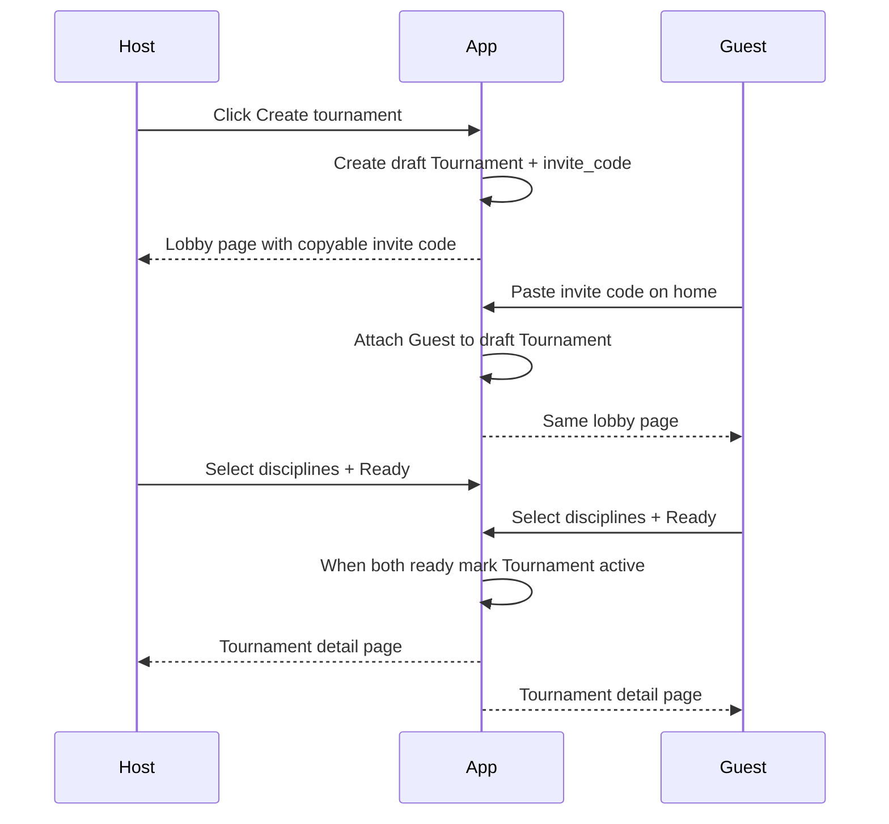

# Tournament invite + discipline selection flow

## Current gap

You already have auth and models in [`accounts/models.py`](accounts/models.py), but they do not match this flow yet:

- `Discipline` is a child of `Tournament` (FK). You need a **global discipline list** both users pick from.
- `Tournament` requires `result`, `start_time`, `end_time` immediately, but an invite lobby exists **before** the match is finalized.
- Home ([`templates/accounts/home.html`](templates/accounts/home.html)) has no create/join/list UI; no tournament URLs/views exist.

## Target flow

## Step 1 — Reshape the data model

Update [`accounts/models.py`](accounts/models.py):

1. Make `Discipline` a **catalog** (remove `tournament` FK). Keep `name`, `description`. Seed a few disciplines via admin or a data migration.
2. Extend `Tournament` for lobby → active lifecycle:
   - `invite_code` (unique, short random string)
   - `status` (`waiting`, `selecting`, `active`) — or boolean flags if you prefer fewer states
   - `host` FK to `User`
   - `users` M2M stays (host + guest)
   - Make `result`, `start_time`, `end_time` **nullable** until the tournament becomes `active`
3. Add a through / participant model, e.g. `TournamentPlayer`:
   - `tournament`, `user`
   - `is_ready` (bool)
   - `selected_disciplines` M2M → `Discipline`
4. When both players have `is_ready=True`, set tournament `status=active`, set `start_time=now()`, attach the **union** of both players’ selected disciplines to the tournament (M2M `Tournament.disciplines`).

Create and apply migrations after this change.

## Step 2 — Server actions (views)

Add tournament views (new module like `accounts/tournament_views.py` or keep in `accounts/views.py`) and wire them in [`accounts/urls.py`](accounts/urls.py):

| Action | Route idea | Behavior |
|--------|------------|----------|
| Create | `POST /tournaments/create/` | Logged-in user creates draft tournament + invite code, adds self as host player, redirects to lobby |
| Lobby | `GET /tournaments/<id>/lobby/` | Show invite code (host), waiting/selection UI; only members can access |
| Join | `POST /tournaments/join/` | Validate invite code from home form; add second user; set status `selecting`; redirect to lobby |
| Save picks + Ready | `POST /tournaments/<id>/ready/` | Save that user’s selected discipline IDs, set `is_ready=True`; if both ready → activate and redirect both to detail |
| Detail | `GET /tournaments/<id>/` | Active tournament page (disciplines, players, times) |
| Lobby status (JSON) | `GET /tournaments/<id>/status/` | Return opponent joined?, both ready?, redirect URL — used by light polling |

Protect every route with `@login_required` and membership checks.

## Step 3 — Main page UI

Update [`templates/accounts/home.html`](templates/accounts/home.html):

- **Create tournament** button → `POST` create
- **Join form** (invite code input + submit)
- **My tournaments** list (links to lobby if not active, detail if active)

## Step 4 — Lobby / create page UI

New templates, e.g.:

- `templates/tournaments/lobby.html` — invite code + copy button; discipline checkboxes; Ready button; “waiting for opponent / waiting for other player to ready”
- `templates/tournaments/detail.html` — final tournament view

Host sees the code immediately; guest lands on the same lobby after join. Until the second user joins, hide or disable Ready (or allow picks but block Ready).

## Step 5 — Sync “both users on the page / both ready”

Do **not** start with WebSockets. Use simple polling from the lobby page (JS `fetch` every 2–3s to `/status/`):

- When opponent joins → refresh UI into discipline selection
- When both ready → redirect to tournament detail

This matches Django’s current stack (no Channels) and is enough for a 2-player flow.

## Step 6 — Admin and seed data

- Register updated models in [`accounts/admin.py`](accounts/admin.py)
- Create a handful of `Discipline` rows so the lobby list is not empty

## Step 7 — Manual test checklist

1. User A creates tournament → copies invite code  
2. User B joins with code → both on lobby  
3. Each selects different disciplines → both press Ready  
4. Both land on the same active tournament page  
5. Both can reopen it from home  
6. Invalid/expired/full invite codes show a clear error  

## Suggested build order

1. Model + migration + seed disciplines  
2. Create / join / lobby / detail views + URLs  
3. Home + lobby + detail templates  
4. Ready logic + activate-on-both-ready  
5. Lobby polling JS  
6. Access control polish and manual 2-browser test  

## Out of scope for this pass

- Real-time websockets  
- More than 2 players  
- Match scoring / setting `result` during play (keep nullable until you add gameplay later)
